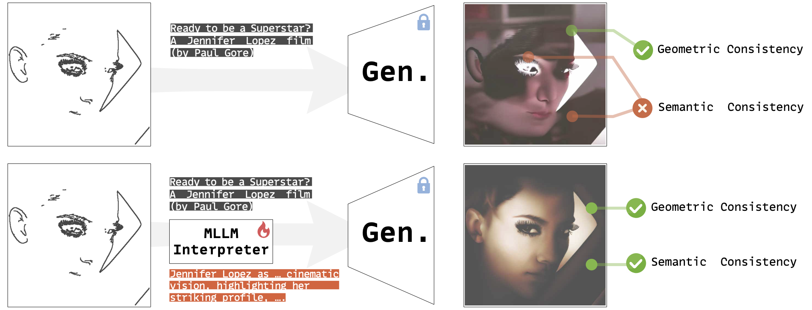
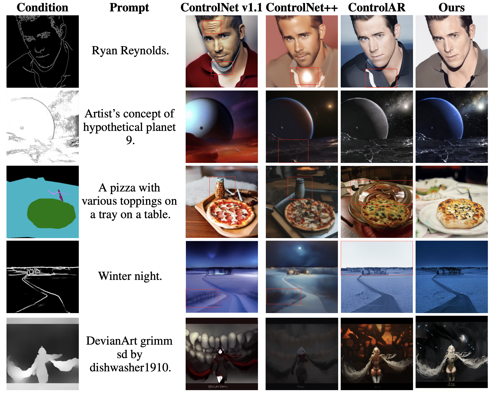

## ControlThinker: Unveiling Latent Semantics for Controllable Image Generation through Visual Reasoning

[](https://arxiv.org/abs/2506.03596) [](https://huggingface.co/maplebb/ControlThinker)

> [Feng Han](https://scholar.google.com/citations?user=oFmRTTkAAAAJ&hl)<sup>1,2\*</sup>, [Yang Jiao](https://sxjyjay.github.io/)<sup>1,2\*</sup>, [Shaoxiang Chen](https://scholar.google.com/citations?user=WL5mbfEAAAAJ)<sup>3</sup>, Junhao Xu<sup>1,2</sup>, [Jingjing Chen](https://jingjing1.github.io/)<sup>1,2</sup>, [Yu-Gang Jiang](https://fvl.fudan.edu.cn/)<sup>1,2</sup>
>
> <sup>1</sup> Shanghai Key Lab of Intell. Info. Processing, School of CS, Fudan University
> <sup>2</sup> Shanghai Collaborative Innovation Center on Intelligent Visual Computing
> <sup>3</sup> Minimax
>
> We introduce ControlThinker, a novel framework bridging the semantic gap in controllable image generation through enhanced visual reasoning. ControlThinker employs a "comprehend-then-generate" paradigm. It utilizes a Multimodal Large Language Model (MLLM) specifically enhanced via supervised and reinforcement fine-tuning to extract latent semantics from control images, generating enriched prompts that significantly enhance visual quality and semantic coherence of generated images without modifying image generators. Extensive experiments across various control types confirm ControlThinker's effectiveness.

<p align="center"></p>

## 📢 News

- **August 5, 2025:** We have released the inference code.
- **July 15, 2025:** We have released our checkpoints on huggingface.
- **June 2, 2025:** We have released the paper of ControlThinker.
- **May 30, 2025:** The codes and models are coming soon.

## 🎮 Environment Set Up
```
conda create -n Controlthinker python=3.10
pip install torch==2.5.1 torchvision==0.20.1 torchaudio==2.5.1 --index-url https://download.pytorch.org/whl/cu124
pip install -r requirements.txt
cd ControlAR
pip install -r requirements.txt
pip3 install -U openmim 
mim install mmengine 
mim install "mmcv==2.1.0"
pip3 install "mmsegmentation>=1.0.0"
pip3 install mmdet
git clone https://github.com/open-mmlab/mmsegmentation.git
```

## Preparing Datasets
First download the vq_ds16_t2i.pt, flan-t5-xl model **from ControlAR**
### For training
Download
```
train-00000-of-02403.parquet
..
train-00020-of-02403.parquet
```
of [MultiGen-20M](https://huggingface.co/datasets/limingcv/MultiGen-20M_depth)( ~10GB) and save the .parquet files to a same directory
Download
```
train-00000-of-00248.parquet
..
train-000040-of-00248.parquet
```
of [COCOStuff with caption](https://huggingface.co/datasets/limingcv/Captioned_COCOStuff)( ~10GB) and save the .parquet files to a same directory

### For evaluation
Download
```
validation-00000-of-00005.parquet
..
validation-00004-of-00005.parquet
```
of [MultiGen-20M](https://huggingface.co/datasets/limingcv/MultiGen-20M_depth)( ~2GB) and save the .parquet files to a same directory

Download
```
validation-00000-of-00011.parquet
..
validation-000010-of-00011.parquet
```
of [COCOStuff with caption](https://huggingface.co/datasets/limingcv/Captioned_COCOStuff)( ~2GB) and save the .parquet files to a same directory

### Data extraction
For MultiGen-20M
```
python ControlAR/autoregressive/test/extract_files_from_multigen_data.py --data-path /dir_of_MultiGen_parquet_fils --code-path /path_of_output_dir --vq-ckpt /path_of_vq_ds16_t2i --t5-path /parent_dir_of_flant5xl --split train/validation
```
For Captioned_COCOStuff
```
python ControlAR/autoregressive/test/extract_files_from_cocostuff_data.py --data-path /dir_of_COCOStuff_parquet_fils --code-path /path_of_output_dir --vq-ckpt /path_of_vq_ds16_t2i --t5-path /parent_dir_of_flant5xl --split train/validation
```
To extract original prompts:
```
python ControlAR/autoregressive/train/extract_file_caption.py --data-path /dir_of_MultiGen_or_COCOStuff_parquet_files --output-path /json_of_ori_prompts --split validation --dataset multigen/cocostuff
```
Place the JSON file of the original prompt in the directory of extracted data and name it `captions.json`

## 🚀 Train


### First stage: SFT with curated data

We adopt [LLaMA-Factory](https://github.com/hiyouga/LLaMA-Factory) for SFT.

### Second stage: Reinforcement Learning

#### Generate control images
```
python ControlAR/condition/hed_batch.py --input_folder /path_of_ori_images --output_folder /path_of_control_images
```
You can change `hed` to `lineart/canny`.

For `depth` and `segmentation`, they are provided by the dataset.

Place the directory of control images in the directory of extracted data.

#### Generate the Formatted Input
```
python -u generate_formatted_dataset_think \
--input_json /json_of_ori_prompts \
--image_dir /path_of_control_images\
--output_json /path_of_formatted_input \
--condition_type hed/depth/canny/lineart/segmentation \
```
#### Start training
Replace the content of `ms-swift/swift/trainers/rlhf_trainer/grpo_trainer.py` with `train/reinforcement-learning/controlthinker_trainer.py`

```
export MASTER_PORT=29501
CUDA_VISIBLE_DEVICES=6,7 \
NPROC_PER_NODE=2 \
swift rlhf \
    --rlhf_type grpo \
    --model /path_of_model \
    --train_type lora \
    --lora_rank 64 \
    --lora_alpha 128 \
    --target_modules all-linear \
    --torch_dtype bfloat16 \
    --dataset /path_of_formatted_input \
    --max_completion_length 1024 \
    --num_train_epochs 1 \
    --per_device_train_batch_size 6 \
    --per_device_eval_batch_size 6 \
    --learning_rate 1e-5 \
    --gradient_accumulation_steps 1 \
    --eval_steps 10000 \
    --save_steps 800 \
    --save_total_limit 10 \
    --logging_steps 1 \
    --max_length 4096 \
    --output_dir /dir_of_output_checkpoints \
    --max_steps 2400 \
    --warmup_ratio 0.05 \
    --dataloader_num_workers 4 \
    --dataset_num_proc 4 \
    --num_generations 12 \
    --temperature 0.9 \
    --deepspeed zero2 \
    --report_to wandb \
    --log_completions true 
```

## 🎳 Inference
**First Download the Checkpoints on [huggingface](https://huggingface.co/maplebb/ControlThinker).**
## 1. Visual reasoning to generate enhanced prompts
### 1.1 Generate control images
**The same as the Second Stage Training**
### 1.2 Generate the Formatted Input
**The same as the Second Stage Training**
### 1.3 Generate the Responses (Ms-Swift)
```
MAX_PIXELS=1003520 \
VIDEO_MAX_PIXELS=50176 \
FPS_MAX_FRAMES=12 \
swift infer \
    --model /path_of_checkpoints \
    --stream false \
    --infer_backend pt \
    --max_batch_size 26 \
    --temperature 0.9 \
    --val_dataset /path_of_formatted_input \
    --result_path /path_of_response \
    --max_new_tokens 2048
```
### 1.4 Formatting Model Response
```
python format_output_think.py \
--input_json /path_of_response \
--output_json /path_of_final_enhanced_prompts
```

## 2. Generate images with enhanced prompts
### 2.1 Generate the text embeddings.
```
python ./ControlAR/autoregressive/sample/ extract_extent_caption_embedding.py \
--json-path /path_of_final_enhanced_prompts \
--output-path /dir_of_new_text_embeddings \
--flan-t5-path /parent_dir_of_flant5xl \
--prompt-num 1 \

# prompt-num is the number of images to generate for orm 
# (1 means no orm)
```
### 2.2 Image generation
First download the edge_base.safetensors, depth_base.safetensors, seg_cocostuff.safetensors, vq_ds16_t2i.pt, flan-t5-xl, dinov2-base, dinov2-small model **from ControlAR**

Place the dinov2-base, dinov2-small model to `autoregressive/models`

For hed/canny/lineart
```
python -u ./ControlAR/autoregressive/test/generate_image_with_new_prompt.py --condition_type hed/canny/lineart --vq_ckpt /path_of_vq_ds16_t2i --gpt_ckpt /path_of_edge_base.safetensors --code_path /path_of_multigen_data --gpt_model GPT-XL --image_size 512 --sample_dir /dir_of_output_images  --seed 0 --adapter_size base --per_proc_batch_size 16 --text_embedding_dir /dir_of_new_text_embeddings --t5_path /dir_of_flant5xl_model
```
For depth
```
python -u ./ControlAR/autoregressive/test/generate_image_with_new_prompt.py --condition_type depth --vq_ckpt /path_of_vq_ds16_t2i --gpt_ckpt /path_of_depth_base.safetensors --code_path /path_of_multigen_data --gpt_model GPT-XL --image_size 512 --sample_dir /dir_of_output_images  --seed 0 --adapter_size base --per_proc_batch_size 16 --text_embedding_dir /dir_of_new_text_embeddings --t5_path /dir_of_flant5xl_model
```
For segmentation
```
python -u ./ControlAR/autoregressive/test/generate_image_with_new_prompt.py --condition_type seg --vq_ckpt /path_of_vq_ds16_t2i --gpt_ckpt /path_of_seg_cocostuff.safetensors --code_path /path_of_multigen_data --gpt_model GPT-XL --image_size 512 --sample_dir /dir_of_output_images  --seed 0 --per_proc_batch_size 16 --text_embedding_dir /dir_of_new_text_embeddings --t5_path /dir_of_flant5xl_model
```

## 3. Inference time scaling

### 3.1 Generate control images

```
python ControlAR/condition/hed_batch.py --input_folder /path_of_generated_images --output_folder /path_of_control_images
```
You can change `hed` to `lineart/canny/depth/seg`.

### 3.2 Pick with quality and text and control signal alignment score

```
python -u inference_scaling.py --ctl_gt_folder /path_of_ground_truth_control_image \
--ctl_candidates_folder /path_of_generated_control_image \
--img_candidates_folder /path_of_generated_image \
--output_folder /path_of_picked_image
```

## 🏆 Evaluation

Download DeepLabV3([weight](https://download.openmmlab.com/mmsegmentation/v0.5/deeplabv3/deeplabv3_r101-d8_512x512_4x4_320k_coco-stuff164k/deeplabv3_r101-d8_512x512_4x4_320k_coco-stuff164k_20210709_155402-3cbca14d.pth)) and save it to `evaluations/`.

Refer to `ControlAR/condition/README.md` for preparing `dpt` model.

Run scripts in `ControlAR/evaluations` to calculate matrices

## 📝 TODO

- [x] Release checkpoints and evaluation code 
- [ ] Released the training code along with an easy-to-follow tutorial.
- [x] Release the paper of ControlThinker

## 🧁 Results

Visualisation of generated images of ControlThinker and other baselines.




## 💥 Quick Start

1️⃣  Codes and tutorial will be available soon.


## ✍️ Citation

```bibtex
@article{han2025controlthinker,
  title={ControlThinker: Unveiling Latent Semantics for Controllable Image Generation through Visual Reasoning},
  author={Han, Feng and Jiao, Yang and Chen, Shaoxiang and Xu, Junhao and Chen, Jingjing and Jiang, Yu-Gang},
  journal={arXiv preprint arXiv:2506.03596},
  year={2025}
}
```


## 📃 License

ControlThinker is licensed under the Apache 2.0.

